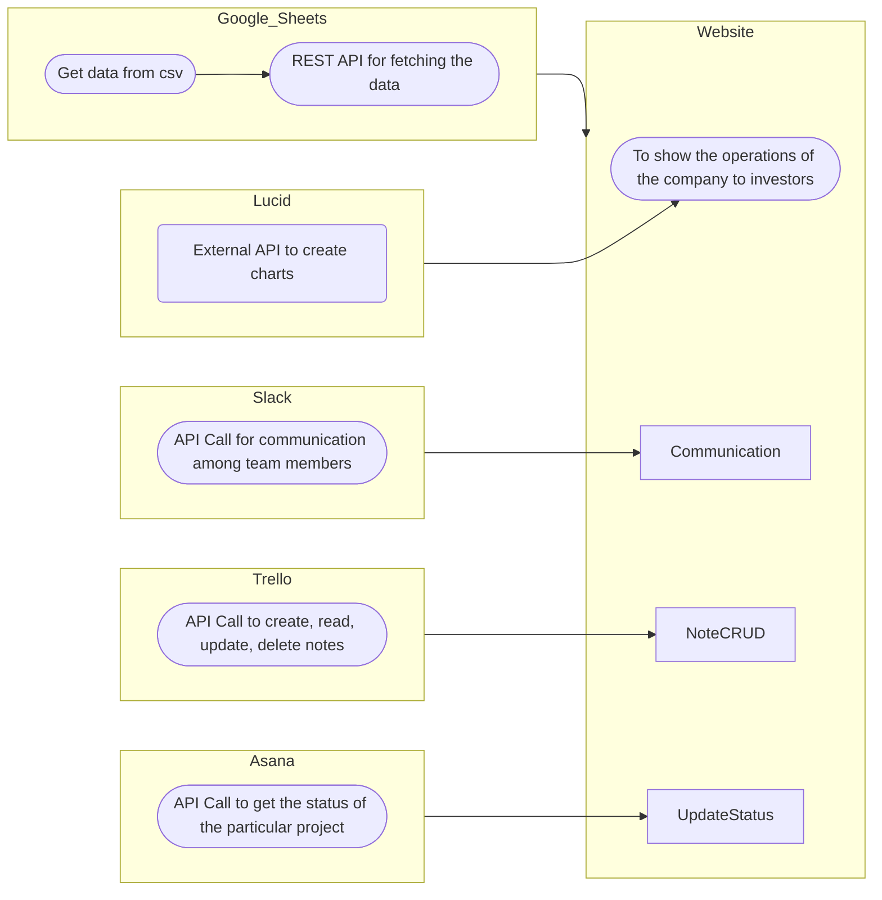

Software to be integrated
+ Google sheets
+ Asana
+ Trello
+ Slack
+ Lucid charts

```mermaid
flowchart LR
	subgraph Google_Sheets
		direction LR
		CSV([Get data from csv]) --> REST_SHEETS([REST API for fetching the data])
	end
	subgraph Asana
		direction LR
		ASANA_API([API Call to get the status of the particular project])
	end
	subgraph Trello
		direction LR
		TRELLO_API([API Call to create, read, update, delete notes])
	end
	subgraph Slack
		direction LR
		SLACK_API([API Call for communication among team members])
	end
	subgraph Lucid
		direction LR
		LUCID_API(External API to create charts)
	end
	subgraph Website
		direction TB
		Chart([To show the operations of the company to investors])
		Communication
		NoteCRUD
		UpdateStatus
	end
Google_Sheets --> Website
Asana --> UpdateStatus
Trello --> NoteCRUD
Slack --> Communication
Lucid --> Chart
```