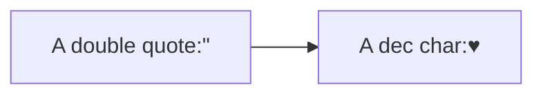
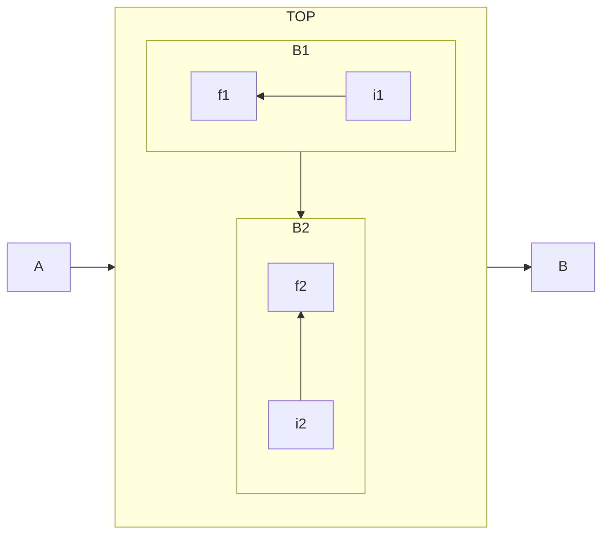
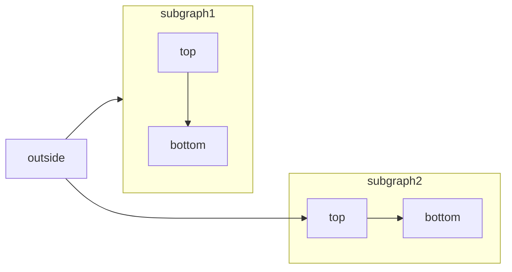

Mermaid creates diagrams and visualizations using text and code.
# Syntax
## Flowcharts
Flowcharts are composed of nodes (geometric shapes) and edges (arrows or lines). The Mermaid code defines how nodes and edges are made and accommodates different arrow types, multi-directional arrows, and any linking to and from subgraphs.

### A Node with text

```mermaid
graph TD
	Start --> Stop("This is unicode text in the box")
 ```
#### Special characters that break syntax
It is possible to put text within quotes in order to render more troublesome characters. As in the example below:
```mermaid
flowchart LR
    id1["This is the (text) in the box"]
```
##### Entity codes to escape characters
It is possible to escape characters using the syntax exemplified here.

### Node Shapes

 ```mermaid
flowchart TD
	NodeShapes
	Round_Edges(This is a node with round corners)
	Box[This is a node with sharp corners]
	Stadium([This is a node which looks like a stadium])
	Subroutine[[This is a node in subroutine shape]]
	Cylinder[(This is a node in a cylindrical shape)]
	Circle((This is a node in a circular shape))
	Asym>This is a node in a asymmetric shape]
	Rhombus{This is a node in a rhombical shape}
	Hexa{{This is a node in a hexagonal shape}}
	Parallelo[/This is a node shaped like a parallelogram/]
	AltParallelo[\This is a node shaped like a parallelogram\]
	Trapezoid[/This is a node shaped like a trapezium\]
	AltTrapezoid[\This is a node shaped like a trapezium/]
	DoubleCircle(((This is a double circle)))
	NodeShapes --> Round_Edges
	NodeShapes --> Box
	NodeShapes --> Stadium
	NodeShapes --> Subroutine
	NodeShapes --> Cylinder
	NodeShapes --> Circle
	NodeShapes --> Asym
	NodeShapes --> Rhombus
	NodeShapes --> Hexa
	NodeShapes --> Parallelo
	NodeShapes --> AltParallelo
	NodeShapes --> Trapezoid
	NodeShapes --> AltTrapezoid
	NodeShapes --> DoubleCircle
```
### Links between nodes

|Length|1|2|3|
|-|-|-|-|
|Normal|---|----|-----|
|Normal with arrow|-->|--->|---->|
|Thick|===|====|=====|
|Thick with arrow | ==>|===>|====>|
|Dotted|-.-|-..-|-...-|
|Dotted with arrow|-.->|-..->|-...->|

### Subgraph
With the graphtype flowcharts you can use the direction statement to set the direction which the subgraph will render.


#### Limitation
If any of a subgraph's nodes are linked to the outside, subgraph direction will be ignored. Instea the subgraph will inherit the direction of the parent graph.

